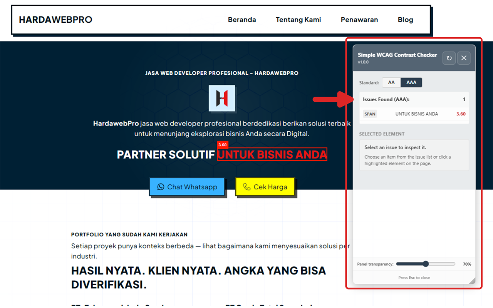
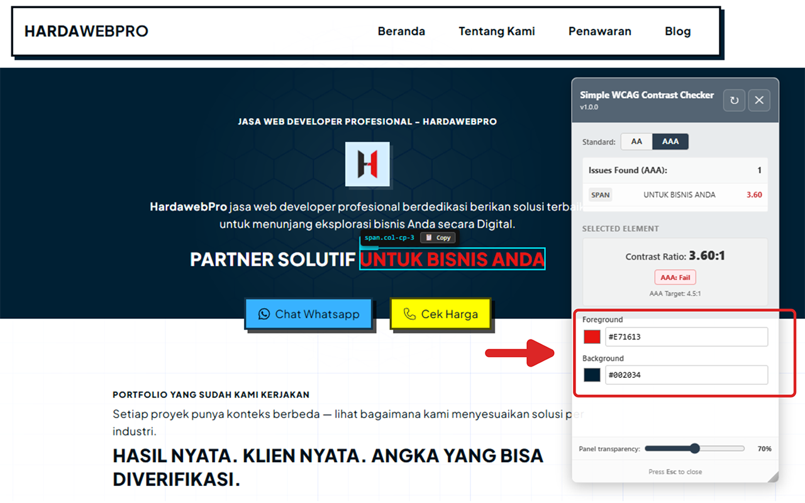
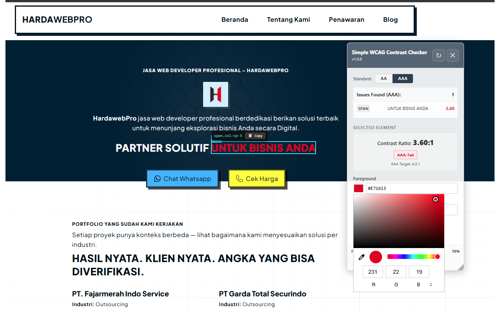

<p align="center">
  
</p>

# Simple WCAG Contrast Checker

> A lightweight Chrome extension that checks color contrast on any webpage against WCAG AA and AAA requirements — no setup, no login, no external services.

[](LICENSE)
[](manifest.json)
[](#installation)

---

## Features

- **WCAG AA & AAA toggle** — switch standards with one click
- **Full-page scan** — detects all visible text elements that fail the selected contrast standard
- **Red overlay highlights** — marks every failing element directly on the page with its contrast ratio
- **Element inspector** — click any highlighted element to view and edit its foreground and background colors in real time
- **Live contrast ratio** — updates instantly as you adjust colors
- **Copy CSS selector** — one-click copy of the failing element's selector for use in your stylesheet
- **Draggable & resizable panel** — position the inspector anywhere on screen
- **Panel transparency control** — adjust panel opacity so it doesn't block your view
- **Persistent settings** — remembers panel position, size, transparency, and selected standard across sessions
- **Shadow DOM isolation** — the extension panel never conflicts with the page's own styles
- **Press Esc to close** — keyboard-friendly

---

## Screenshots

<p align="center">
  
  
  
</p>

All product images are stored in the [`docs/`](docs/) folder.

---

## Installation

### From Chrome Web Store _(recommended)_

> **Coming soon** — the extension is currently under review.

### Manual Installation (Developer Mode)

1. Download or clone this repository
2. Open Chrome and go to `chrome://extensions`
3. Enable **Developer mode** (toggle in the top right)
4. Click **Load unpacked**
5. Select the root folder of this repository
6. The extension icon will appear in your Chrome toolbar

---

## How to Use

1. Open any webpage you want to check
2. Click the **Simple WCAG Contrast Checker** icon in the Chrome toolbar
3. The inspector panel opens and automatically scans the page
4. Failing elements are highlighted with a **red border** and their contrast ratio
5. Click any highlighted element to open it in the editor panel
6. Adjust the foreground or background color to see the ratio update live
7. Use the **AA / AAA** toggle to switch between contrast standards
8. Click **↻ Rescan** after making CSS changes to refresh the results
9. Press **Esc** or click **✕** to close the panel

---

## Permissions

| Permission       | Why it is needed                                                                  |
| ---------------- | --------------------------------------------------------------------------------- |
| `activeTab`      | Activates the extension on the current tab when you click the icon                |
| `scripting`      | Injects the inspector panel and runs the contrast analysis on the current page    |
| `storage`        | Saves your preferences (panel position, size, opacity, selected standard) locally |
| `clipboardWrite` | Writes the CSS selector to your clipboard when you click the Copy button          |

No data is collected, transmitted, or shared. All processing happens locally in your browser.

---

## Privacy

**Simple WCAG Contrast Checker does not collect any personal data.**

Full privacy policy: [https://hardawebpro.com/support/privacy-policy-simple-wcag-contrast-checker/](https://hardawebpro.com/support/privacy-policy-simple-wcag-contrast-checker/)

---

## Tech Stack

- **Manifest V3** — Chrome Extensions platform, latest version
- **Vanilla JavaScript** — no frameworks, no dependencies
- **Shadow DOM** — panel isolation from host page styles
- **Chrome Storage API** — local preference persistence
- **WCAG 2.1 contrast algorithm** — relative luminance via sRGB linearization

---

## WCAG Contrast Standards

| Standard | Normal text | Large text |
| -------- | ----------- | ---------- |
| WCAG AA  | 4.5 : 1     | 3.0 : 1    |
| WCAG AAA | 7.0 : 1     | 4.5 : 1    |

_Large text is defined as 24px or larger, or 18.6px or larger when bold._

---

## File Structure

```
simple-wcag-contrast-checker/
├── manifest.json       # Extension manifest (MV3)
├── background.js       # Service worker — handles toolbar icon click
├── content.js          # Main logic — panel, scan, highlight, editor
├── style.css           # Panel styles (loaded into Shadow DOM)
├── icon16.png          # Extension icon 16×16
├── icon48.png          # Extension icon 48×48
├── icon128.png         # Extension icon 128×128
└── docs/
    ├── hardawepro-logo-big-transparent.png  # Extension logo
    ├── screenshot-1.png                     # Product screenshot
    ├── screenshot-2.png                     # Product screenshot
    └── screenshot-3.png                     # Product screenshot
```

---

## License

[MIT](LICENSE) © 2026 [HardaWebPro](https://hardawebpro.com)

---

## Support

For questions or issues, visit: [https://hardawebpro.com/support/#simple-wcag-contrast-checker](https://hardawebpro.com/support/#simple-wcag-contrast-checker)
